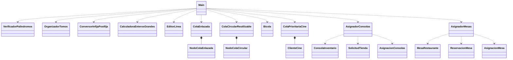

# Análisis del proyecto: Tarea Pilas y Colas

## Alcance

El proyecto reúne once ejercicios independientes de estructuras lineales. `Main` presenta un menú declarativo y ejecuta la clase elegida. Los nombres de los archivos `.java` coinciden con sus clases públicas.

## Clases y archivos fuente

| Archivo y clase | Responsabilidad |
|---|---|
| `VerificadorPalindromos.java` | Comprueba si un texto es palíndromo usando una pila. |
| `OrganizadorTomos.java` | Ordena tomos provenientes de dos repisas. |
| `ConversorInfijaPostfija.java` | Convierte expresiones infijas a postfijas. |
| `CalculadoraEnterosGrandes.java` | Suma y resta enteros de longitud arbitraria. |
| `EditorLinea.java` | Simula edición de texto mediante una pila. |
| `ColaEnlazada.java` | Implementa una cola FIFO enlazada. |
| `ColaCircularReutilizable.java` | Implementa una cola circular que reutiliza nodos. |
| `Bicola.java` | Implementa un `deque` con operaciones en ambos extremos. |
| `ColaPrioritariaCine.java` | Prioriza clientes asiduos en una fila de cine. |
| `AsignadorConsolas.java` | Asigna inventario de consolas a tiendas solicitantes. |
| `AsignadorMesas.java` | Asigna mesas a reservaciones. |
| `Main.java` | Coordina la ejecución desde el menú principal. |

## Diagrama UML de clases

## Análisis por caso

| Clase | Estrategia | Complejidad |
|---|---|---|
| `VerificadorPalindromos` | Normaliza el texto y compara sus caracteres contra una pila. | `O(n)` |
| `OrganizadorTomos` | Extrae los tomos de dos pilas y los ordena. | `O(n log n)` |
| `ConversorInfijaPostfija` | Mantiene operadores pendientes según prioridad y asociatividad. | `O(n)` |
| `CalculadoraEnterosGrandes` | Procesa los dígitos desde las unidades con acarreo o préstamo. | `O(n)` |
| `EditorLinea` | Apila caracteres y procesa comandos de borrar o limpiar. | `O(n)` |
| `ColaEnlazada` | Mantiene referencias al primer y último nodo para operar FIFO. | Básicas: `O(1)` |
| `ColaCircularReutilizable` | Separa nodos ocupados y disponibles para reutilizarlos. | `O(n)` por búsqueda del último nodo |
| `Bicola` | Usa `ArrayDeque` para agregar o eliminar en ambos extremos. | `O(1)` amortizado |
| `ColaPrioritariaCine` | Atiende primero la cola FIFO de clientes asiduos. | `O(1)` |
| `AsignadorConsolas` | Consume inventario y solicitudes respetando el orden de llegada. | `O(c + s)` |
| `AsignadorMesas` | Atiende reservaciones FIFO y selecciona una mesa apta. | `O(r × m)` |

## Clases internas

- `NodoColaEnlazada` y `NodoColaCircular` representan los nodos de sus respectivas colas.
- `ClienteCine` representa a una persona en la fila prioritaria.
- `ConsolaInventario`, `SolicitudTienda` y `AsignacionConsolas` modelan la distribución de consolas.
- `MesaRestaurante`, `ReservacionMesa` y `AsignacionMesa` modelan la asignación de mesas.
